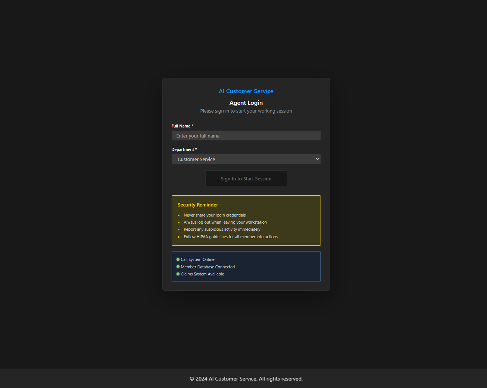
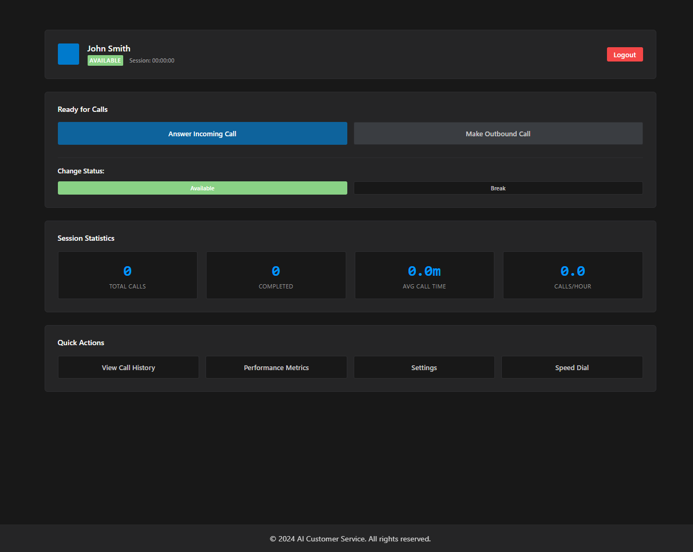
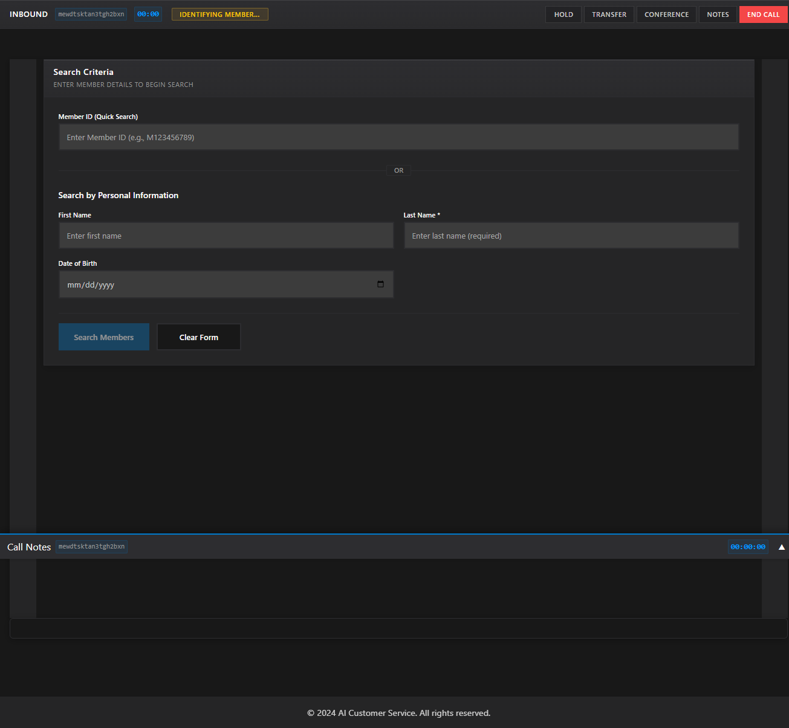
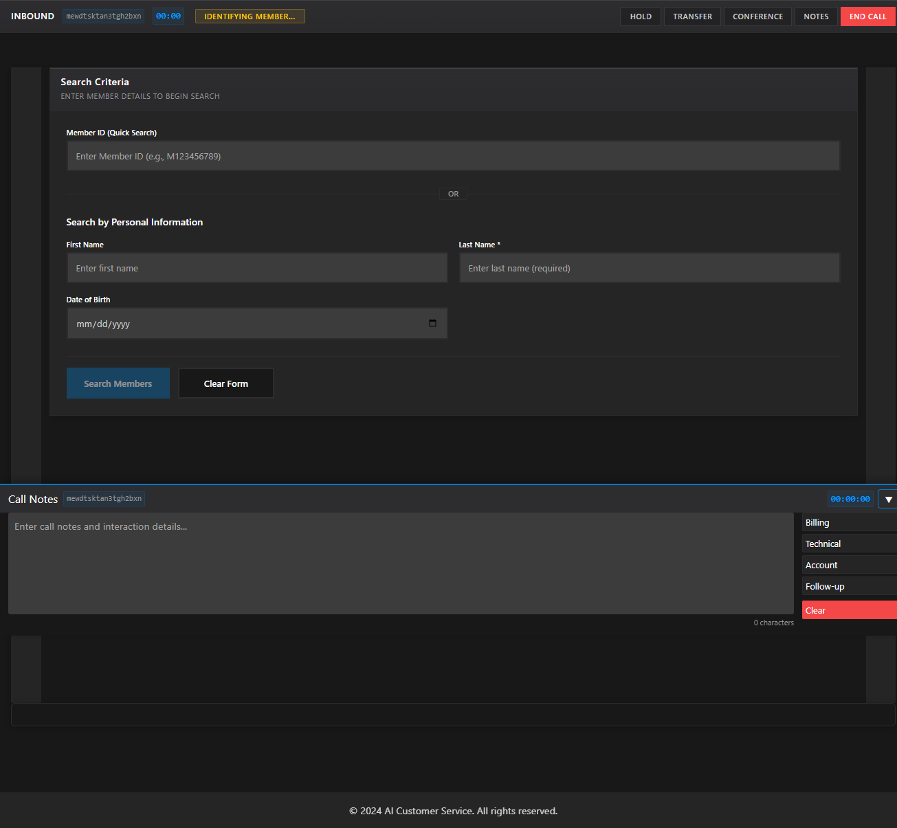
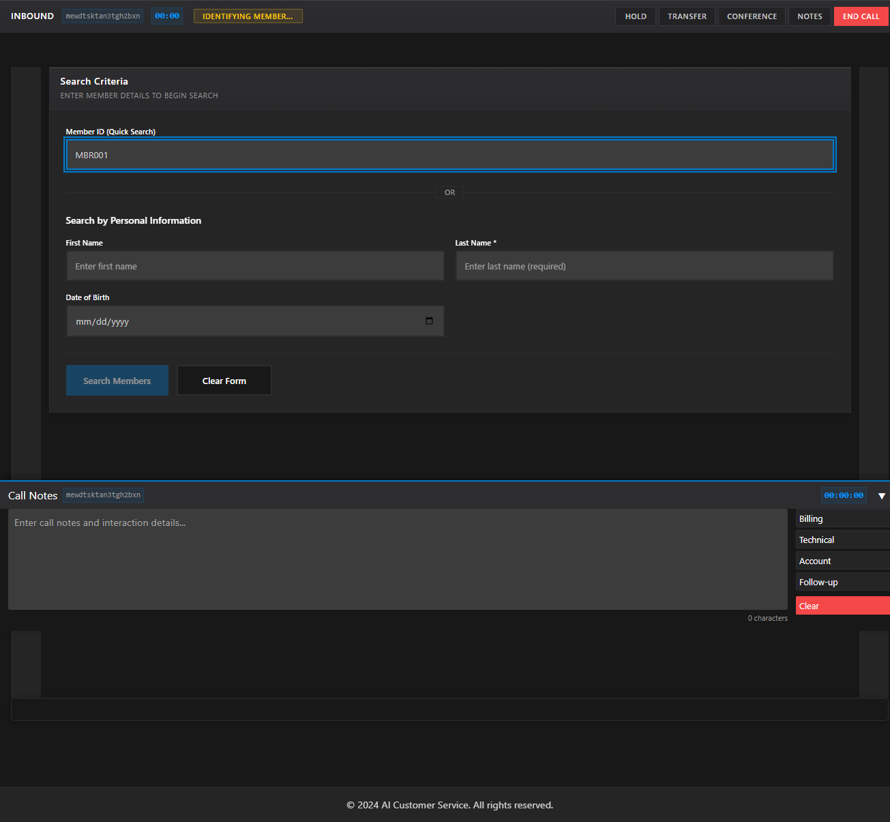
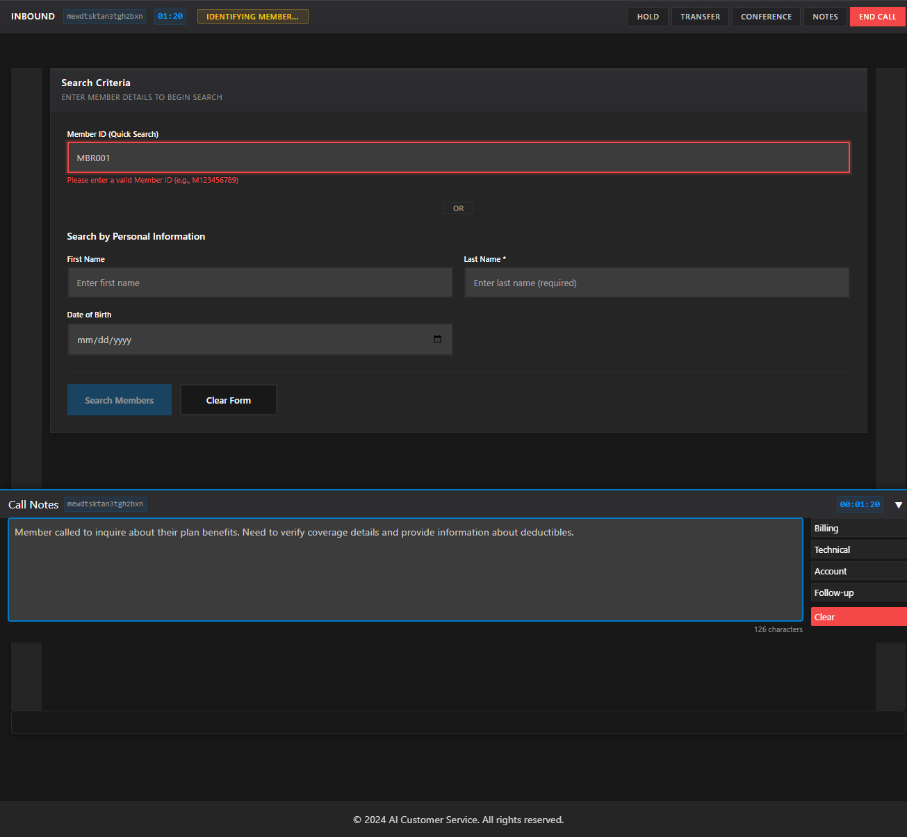

# AI Customer Service Application# Health Insurance Call Center Application


[](https://github.com/vincemic/ai-customer-service/actions/workflows/ci-cd.yml)An Angular 18+ application designed for health insurance call center operations, enabling service representatives to efficiently lookup member information, track calls, and manage customer interactions with a modern VS Code-inspired dark theme interface.


A modern AI-powered customer service application built with Angular 18+ featuring call management, member lookup, and integrated call notes functionality.## Features


## 🚀 Live Demo- **Modern Angular 18+** with standalone components and signal-based state management

- **VS Code Dark Theme UI** - Consistent dark theme styling throughout the application

- **GitHub Pages Demo**: [https://vincemic.github.io/ai-customer-service](https://vincemic.github.io/ai-customer-service)- **Central Loading Service** - Unified loading states with contextual messages and realistic delays

- **Call Session Management** - Track calls from start to finish with professional interface

## ✨ Features- **Member Lookup** - Search by Member ID, name, and date of birth with instant feedback

- **Comprehensive Member Information**:

- **Call Management**: Start, manage, and end customer service calls  - Demographics and contact information

- **Member Lookup**: Search and retrieve member information  - Claims history with status tracking

- **Call Notes**: Real-time call notes with quick actions and persistence  - Benefits information and accumulators

- **Agent Dashboard**: Comprehensive agent interface  - Prior authorizations and history

- **Responsive Design**: Mobile-friendly interface with VS Code dark theme  - Call history tracking

- **Real-time Updates**: Live call duration and session management- **Async/Await Architecture** - Modern Promise-based data operations with loading integration

- **Keyboard & Mouse Navigation** - Full accessibility support

## � Screenshots

### Agent Login

*Clean, professional login interface with security reminders and system status indicators.*

### Agent Dashboard

*Comprehensive agent dashboard showing session statistics, quick actions, and call controls.*

### Call Interface

*Professional call management interface with member lookup and call controls.*

### Call Notes (Expanded)

*Expandable call notes footer with quick action buttons and real-time character count.*

### Member Search

*Intuitive member lookup with multiple search options and validation.*

### Call Notes with Content

*Active call session with notes being taken and persistent footer interface.*

## �🛠️ Technology Stack- **Responsive Design** - Works on desktop and mobile devices

- **Mock Data Service** - Ready for integration with real APIs with realistic network simulation

- **Frontend**: Angular 18+ with standalone components

- **State Management**: Angular Signals## Technology Stack

- **Styling**: CSS Custom Properties with VS Code Dark Theme

- **Testing**: Playwright for E2E testing- **Frontend**: Angular 18+ with TypeScript

- **Deployment**: GitHub Pages with automated CI/CD- **Styling**: CSS3 with responsive design

- **Testing**: Jasmine, Karma, and Playwright

## 🌍 Environments- **CI/CD**: GitHub Actions

- **Deployment**: GitHub Pages ready

The application supports multiple deployment environments:

## Development Setup

### Development

- **Purpose**: Local development and testing### Prerequisites

- **Configuration**: `environment.ts`

- **Features**: Debug logging, source maps, unoptimized builds- Node.js 18 or higher

- **Command**: `npm run start:dev`- npm or yarn

- Git

### Production

- **Purpose**: Production deployment### Installation

- **Configuration**: `environment.prod.ts`

- **Features**: Optimized builds, analytics enabled, minification1. Clone the repository:

- **Command**: `npm run build:prod`   ```bash

   git clone <repository-url>

### GitHub Pages   cd ai-customer-service

- **Purpose**: Demo deployment on GitHub Pages   ```

- **Configuration**: `environment.github-pages.ts`

- **Features**: Production optimizations with GitHub Pages-specific settings2. Install dependencies:

- **Command**: `npm run build:github-pages`   ```bash

- **Base Href**: `/ai-customer-service/`   npm install

   ```

## 🚀 Getting Started

3. Start the development server:

### Prerequisites   ```bash

   npm start

- Node.js 20 or higher   ```

- npm or yarn package manager

4. Open your browser to `http://localhost:4200`

### Installation

## Available Scripts

1. **Clone the repository**

   ```bash- `npm start` - Start development server

   git clone https://github.com/vincemic/ai-customer-service.git- `npm run build` - Build for production

   cd ai-customer-service- `npm run build:github-pages` - Build for GitHub Pages deployment

   ```- `npm test` - Run unit tests

- `npm run test:ci` - Run tests in CI mode

2. **Install dependencies**- `npm run e2e` - Run Playwright end-to-end tests

   ```bash- `npm run e2e:ui` - Run Playwright tests with UI

   npm install- `npm run lint` - Run linting

   ```

## Environments

3. **Start development server**

   ```bashThe application supports multiple environments:

   npm start

   # or for specific environment- **Development** (`environment.ts`) - Local development

   npm run start:dev- **Production** (`environment.prod.ts`) - Production deployment

   ```- **GitHub Pages** (`environment.github-pages.ts`) - GitHub Pages deployment


4. **Open browser**## Project Structure

   Navigate to `http://localhost:4200`

```

## 📦 Available Scriptssrc/

├── app/

### Development│   ├── components/           # Angular standalone components

- `npm start` - Start development server (port 4200)│   │   ├── member-lookup.component.*

- `npm run start:dev` - Start with development configuration│   │   ├── member-details.component.*

- `npm run start:prod` - Start with production configuration│   │   ├── member-data-view/

- `npm run watch` - Build with file watching│   │   │   └── member-data-view.component.*

│   │   ├── member-demographics/

### Building│   │   │   └── member-demographics.component.*

- `npm run build` - Build for production│   │   ├── call-session.component.*

- `npm run build:dev` - Build for development│   │   └── loading-spinner.component.*

- `npm run build:prod` - Build for production│   ├── services/            # Service layer for data access

- `npm run build:github-pages` - Build for GitHub Pages deployment│   │   ├── member.service.ts

│   │   ├── call-session.service.ts

### Testing│   │   └── loading.service.ts

- `npm run e2e` - Run Playwright end-to-end tests│   ├── models/              # TypeScript interfaces and types

- `npm run e2e:ui` - Run Playwright tests with UI mode│   │   └── member.model.ts

- `npm run e2e:debug` - Run Playwright tests in debug mode│   ├── styles/              # Global theme styles

- `npm run lint` - Run linting│   │   └── pointc-theme.css

│   └── environments/        # Environment configurations

### Utilities├── e2e/                     # Playwright tests

- `npm run serve:dist` - Serve built application locally└── .github/

- `npm run analyze` - Analyze bundle size    └── workflows/           # GitHub Actions CI/CD

```

## 🔄 CI/CD Pipeline

## Component Architecture

The project uses GitHub Actions for automated building, testing, and deployment:

### Call Session Management

### Pipeline Features

- **Multi-environment builds**: Verifies all environment configurations- **CallSessionComponent**: Manages active call sessions with VS Code-styled interface

- **Playwright testing**: Runs E2E tests (non-blocking for deployment)- Tracks call duration, agent information, and call notes

- **Automated deployment**: Deploys to GitHub Pages on main branch pushes- Provides modal for ending calls with final notes

- **Artifact management**: Stores test reports and build artifacts

- **Environment verification**: Validates all environment configurations### Member Lookup


### Pipeline Triggers- **MemberLookupComponent**: Search interface for member identification with loading integration

- Push to `main` branch- Supports search by Member ID, name, and date of birth

- Pull requests to `main` branch- Form validation, error handling, and real-time loading feedback

- Manual workflow dispatch

### Member Details

### Deployment Process

1. **Checkout code** and setup Node.js environment- **MemberDetailsComponent**: Clean two-tab interface for member information

2. **Install dependencies** with caching- Demographics & Family tab for personal information

3. **Verify environments** and configurations- Claims, Benefits & History tab for comprehensive data view

4. **Run linting** (continues on error)- Responsive design with keyboard navigation (legacy view removed)

5. **Build verification** for all environments

6. **Install Playwright** and run E2E tests (non-blocking)### Member Data View

7. **Build for GitHub Pages** with optimizations

8. **Deploy to GitHub Pages** (main branch only)- **MemberDataViewComponent**: Comprehensive tabbed interface for member data

- Claims, benefits, accumulators, prior authorizations, and history

## 🏗️ Architecture- Async data loading with contextual loading messages


### Component Structure### Loading System

```

src/- **LoadingSpinnerComponent**: VS Code-themed loading overlay with spinner animation

├── app/- **LoadingService**: Signal-based centralized loading state management

│   ├── components/          # Standalone Angular components- Contextual loading messages and realistic network delay simulation

│   │   ├── agent-dashboard/ # Agent management interface

│   │   ├── call-management/ # Call control interface## Service Layer

│   │   ├── call-notes-footer/ # Persistent call notes

│   │   ├── member-lookup/   # Member search functionality### MemberService

│   │   └── ...- Mock data service for member information

│   ├── services/           # Injectable services- Simulates API calls with realistic delays

│   │   ├── agent-session.service.ts- Provides methods for searching and retrieving member data

│   │   ├── member.service.ts

│   │   └── ...### CallSessionService

│   ├── models/            # TypeScript interfaces- Manages call session state using Angular signals

│   └── ...- Tracks call lifecycle from start to completion

├── environments/          # Environment configurations- Integrates with member identification workflow

└── styles/               # Global styles and themes

```## Testing


### Key Services### Unit Tests

- **AgentSessionService**: Manages agent login and call sessionsRun with Jest and Angular Testing Utilities:

- **MemberService**: Handles member lookup and data retrieval```bash

- **MemberStateService**: Manages member state across componentsnpm test

- **LoadingService**: Centralized loading state management```


## 🎨 Styling### End-to-End Tests

Run with Playwright:

The application uses a custom VS Code dark theme with:```bash

- CSS Custom Properties for consistent themingnpm run e2e

- Responsive design patterns```

- Mobile-first approach

- Accessibility considerations## Deployment


## 🧪 Testing### GitHub Pages

The application is configured for automatic deployment to GitHub Pages:

### Playwright E2E Tests

The application includes comprehensive end-to-end tests using Playwright:1. Push to the `main` branch

2. GitHub Actions will build and test the application

- **Test Coverage**: Login flow, member lookup, call management3. If tests pass, deploys to GitHub Pages

- **Cross-browser**: Supports Chrome, Firefox, and Safari4. Failed tests do not prevent deployment (as requested)

- **CI Integration**: Automated testing in GitHub Actions

- **Reports**: Detailed test reports with screenshots### Manual Deployment

Build for production:

### Running Tests Locally```bash

```bashnpm run build:github-pages

# Install Playwright browsers```

npx playwright install

## Accessibility

# Run tests

npm run e2eThe application follows WCAG guidelines:

- Semantic HTML structure

# Run with UI- ARIA labels and roles

npm run e2e:ui- Keyboard navigation support

- Screen reader compatibility

# Debug mode- High contrast color schemes

npm run e2e:debug- Focus indicators

```

## Browser Support

## 📈 Performance

- Chrome 90+

### Build Optimizations- Firefox 88+

- **Tree Shaking**: Removes unused code- Safari 14+

- **Bundle Splitting**: Optimized code splitting- Edge 90+

- **Compression**: Gzip compression enabled

- **Caching**: Aggressive caching strategies## Contributing


### Bundle Size Limits1. Fork the repository

- Initial bundle: < 1MB2. Create a feature branch

- Component styles: < 8KB each3. Make your changes

4. Add tests for new functionality

## 🚀 Deployment5. Submit a pull request


### Automatic Deployment## License

Every push to the `main` branch triggers automatic deployment to GitHub Pages.

This project is licensed under the MIT License.

### Manual Deployment

```bash## Support

# Build for GitHub Pages

npm run build:github-pagesFor questions or issues, please contact the development team.

# The dist/ai-customer-service folder contains the deployable application
```

### Environment Variables
The application uses environment-specific configurations without requiring environment variables during build time.

## 🤝 Contributing

1. Fork the repository
2. Create a feature branch: `git checkout -b feature/amazing-feature`
3. Commit changes: `git commit -m 'Add amazing feature'`
4. Push to branch: `git push origin feature/amazing-feature`
5. Open a Pull Request

### Development Guidelines
- Use Angular 18+ standalone components
- Follow the established coding patterns
- Write Playwright tests for new features
- Ensure responsive design compatibility
- Update documentation as needed

## 📝 License

This project is licensed under the MIT License - see the [LICENSE](LICENSE) file for details.

## 🆘 Support

For support and questions:
- Create an issue in the GitHub repository
- Check the [GitHub Actions logs](https://github.com/vincemic/ai-customer-service/actions) for deployment status
- Review the [live demo](https://vincemic.github.io/ai-customer-service) for expected functionality

---

**Built with ❤️ using Angular 18+ and deployed with GitHub Actions**